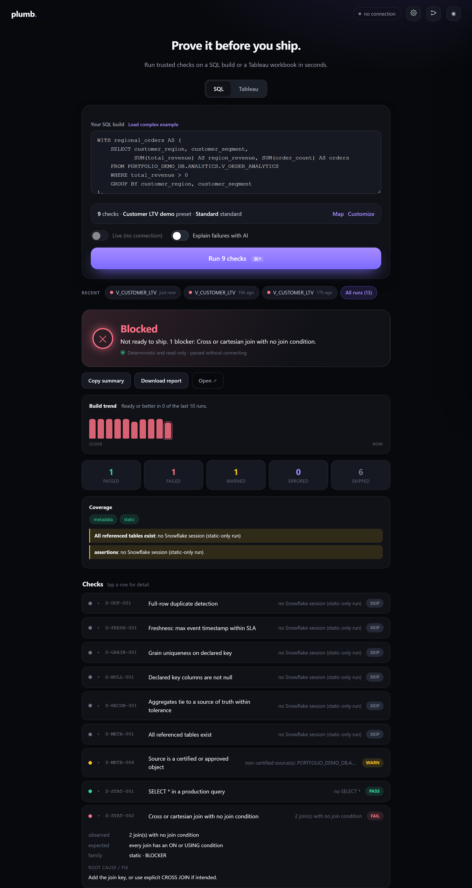

# Plumb

[](https://github.com/vikasrathee1803/plumb-qc/actions/workflows/ci.yml)
[](LICENSE)
[](https://www.python.org/)
[](https://github.com/vikasrathee1803/plumb-qc/releases/latest)

The BI team's pre-publish QC gate. Plumb is one local-first, centrally
governed tool that proves a BI artifact is correct **before** it ships —
and produces a shareable confidence report with a deterministic verdict.



## One tool, three jobs

Everything a BI team publishes goes through the same engine, the same
ruleset, the same verdict tiers (BLOCKED / REVIEW / READY_WITH_NOTES /
READY), and the same HTML + JSON + JUnit reports:

| Job | Command | Catches |
|---|---|---|
| **SQL build QC** | `plumb check sql --query build.sql` | cross-join fan-out, grain breaks, null drift, referential gaps, freshness misses, regression vs a golden baseline, cost smells |
| **Workbook QC** | `plumb check tableau --workbook dash.twbx` | risky FIXED LODs, grain-mismatched calcs, uncertified/extract sources, naming and hygiene issues |
| **Migration parity** | `plumb parity snapshot` / `check` / `estate` | a re-pointed workbook silently showing different numbers on the new warehouse — proven object by object, wave by wave |

Where Plumb sits in the stack: dbt tests / Great Expectations / Soda guard
the *pipeline*; Plumb guards the **last mile** — the SQL build and the
workbook a human is about to publish, and the cut-over when an estate
moves warehouses. It complements pipeline testing, it does not replace it.

## Install

```
pipx install plumb        # from the internal package index
```

## Quick start

```
plumb init                                   # scaffold connection profile
plumb rules pin 2026.06.0                    # pin the team standard
plumb check sql --query daily_sales.sql --profile finance
plumb check tableau --workbook daily_sales.twbx
plumb report open
```

Exit codes for CI: 0 passing, 1 REVIEW, 2 BLOCKED, 3 tool error.

## CI gate in five lines

Every command writes `report.junit.xml` and exits per the contract above,
so any CI runner can gate a merge or a publish:

```yaml
# .github/workflows/bi-qc.yml (step)
- run: plumb check sql --query builds/daily_sales.sql --static-only --out qc
- uses: actions/upload-artifact@v4
  if: always()
  with: { name: plumb-report, path: qc/ }
```

Use `--static-only` for connectionless PR checks; give CI a key-pair
profile for live metadata/assertion coverage. `plumb parity estate`
additionally writes `estate.junit.xml` with one test case per workbook —
a migration wave shows up in CI as N named red or green rows.

## Guarantees

- Read-only everywhere. The engine refuses any statement that is not a
  read, and there is a test that proves it.
- Deterministic verdicts. No LLM ever decides a pass or fail.
- Every query is tagged plumb_qc:{run_id}, runs on the dedicated PLUMB_WH
  warehouse, and respects the statement timeout and row cap.
- Auth is key-pair, externalbrowser SSO, or OAuth. No passwords, no
  secrets in config or source.

## Run it (web UI)

No Python or Node? Download the **portable build** from the
[latest release](https://github.com/vikasrathee1803/plumb-qc/releases/latest):
unzip and double-click `run.bat`. It carries its own Python and every
dependency, runs on http://127.0.0.1:8777, and needs no install and no admin.

From a source checkout: one click, nothing to type, double-click **`run.bat`**
(Windows) or run **`./run.sh`** (macOS/Linux). It builds the UI on first run,
then opens http://127.0.0.1:8000.

Or run it by hand:

```
cd web/ui && npm install && npm run build      # once
plumb web                                       # serves API + SPA on :8000
```

The web UI wraps the same engine and renders the same verdict, coverage, and
report as the CLI. Run a SQL check, upload a .twb/.twbx, prove a migration
from the Migration tab (snapshot → check, optional map and post-swap mode —
single workbooks; waves stay on `plumb parity estate`), open the query map, or
configure your Snowflake/Tableau connection from the gear icon (credentials stay
local: config in ~/.plumb, secrets in your OS keychain).

Frontend hot-reload (for development): `cd web/ui && npm run dev` starts the
backend and Vite together (Vite on :5173 proxies /api to :8000). It sets
PLUMB_DISABLE_AUTH for loopback dev only; `plumb web` keeps the API token on.

## AI assist (Phase 2, opt-in)

`plumb check sql --query f.sql --explain` attaches plain-English
explanations to failing checks. It runs only after the verdict is decided
and never changes a status. AI assist runs in-database via Snowflake Cortex
(no external API key, no data egress); enable it with PLUMB_CORTEX_MODEL on a
live run. Without it, the run is unaffected.

## Migration parity (galaxy / UDM cut-over)

Migrating workbooks to a new warehouse or presentation layer? Prove the
numbers match before anyone eyeballs dashboards side by side:

```
plumb parity snapshot --workbook sales.twbx --map galaxy-map.yml   # legacy side
# ... re-point the workbook (Tableau Autopilot swap-connection) ...
plumb parity check    --workbook sales.twbx --map galaxy-map.yml   # migrated side
```

`snapshot` derives the Snowflake objects the workbook depends on, measures
them read-only (row counts, per-column aggregates, null/distinct counts,
optional grain groups), and saves one baseline per object. `check` measures
the mapped target objects and compares: drift is a BLOCKED verdict with the
worst offenders named. Joins/unions/extract-only sources are refused and
reported in coverage, never guessed at. Custom SQL sources get column-level
metrics too when their projection parses cleanly (anything unparseable
falls back to row-count-only, honestly noted). The map file declares
old→new renames, keys, grain, and tolerances; unlisted objects compare
under their own names. See docs/RUNBOOK.md for the full migration play and
docs/adr/ADR-0013-migration-parity-family.md for the design.

Migrating a whole wave at once? The estate runner rolls N workbooks into
one verdict (BLOCKED if any workbook is blocked or errored — every
offender named, no thresholds):

```
plumb parity estate --manifest "wave1/*.twbx" --map galaxy-map.yml --phase snapshot
# ... Autopilot swaps the wave ...
plumb parity estate --manifest "wave1/*.twbx" --map galaxy-map.yml --phase check --post-swap
```

`--phase run` does snapshot-then-check back to back when you can read both
sides (`--connection-legacy`/`--connection-target`); `plumb parity run`
does the same for a single workbook. `--post-swap` checks the
already-swapped artifact by applying the map inverted. The roll-up writes
`estate.html` plus a per-workbook `estate.junit.xml` for CI. See
docs/RUNBOOK.md ("Wave migration play") and docs/adr/ADR-0015 for the
design.

## Shared baselines (Phase 2)

Point all analysts at one baseline location (a network share or mounted
object store) via ~/.plumb/baselines.yml ({kind: shared, path: ...}) or
PLUMB_BASELINE_DIR. Never a Snowflake write (ADR-0012).

## Troubleshooting

If anything will not start (for example `ModuleNotFoundError: No module named
'uvicorn'`), run the self-check first:

```
plumb doctor                    # installed CLI
python scripts/selfcheck.py     # from a source checkout
check.bat                       # inside the portable build
```

It reports every runtime dependency, every module import, the engine, and the
web app as PASS or FAIL, so a missing dependency or broken import is named
exactly instead of surfacing as a cryptic traceback at launch. In the portable
build, always start with `run.bat` (it uses the bundled Python); double-clicking
`run_plumb.py` can pick a different Python that lacks the dependencies.

## Project state

Phases 0, 1, and 2 are complete: SQL engine, Tableau static analysis, web
UI, opt-in AI assist, shared baselines. Verified against live Snowflake.
Phase 3 (Tableau live reconciliation and lineage) is deferred. See
docs/SPRINT.md for status and docs/ARCHITECTURE.md for the contracts.

## Development

```
py -3.12 -m venv .venv
.venv\Scripts\python -m pip install -e ".[dev]"
.venv\Scripts\python -m pytest
.venv\Scripts\python -m ruff check plumb tests
.venv\Scripts\python -m mypy plumb
```
